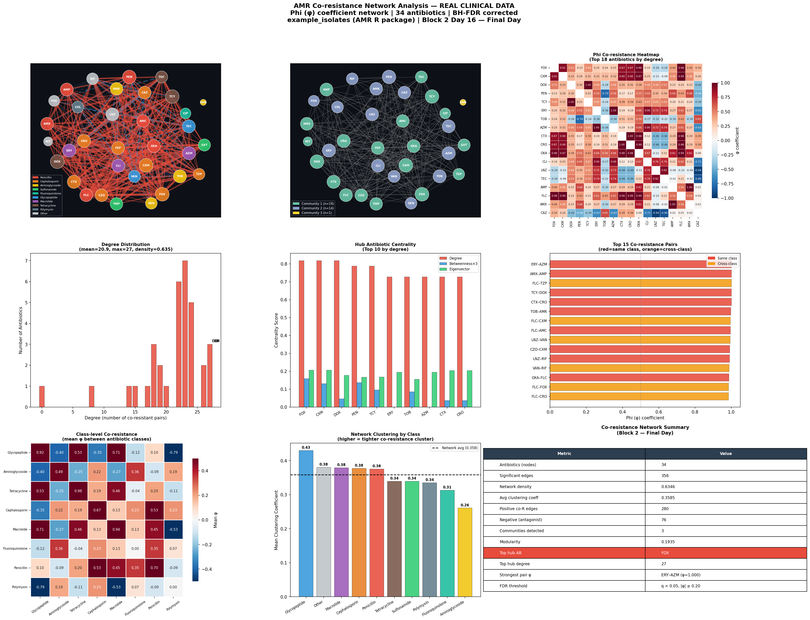

# Day 16 — AMR Co-resistance Network Analysis
### 🧬 30 Days of Bioinformatics | Subhadip Jana


> Graph-theoretic co-resistance network of 34 antibiotics across 2,000 clinical isolates — φ coefficient edges, community detection, hub centrality, and cross-class resistance patterns. **Final day of Block 2.**

---

## 📊 Dashboard


---

## 🕸️ Network Statistics

| Metric | Value |
|--------|-------|
| Nodes (antibiotics) | 34 |
| Significant edges (FDR<0.05, \|φ\|≥0.20) | **356** |
| Network density | 0.635 |
| Positive co-resistance edges | 280 |
| Negative (antagonistic) edges | 76 |
| Communities detected | **3** |
| Modularity | 0.194 |
| Avg clustering coefficient | 0.359 |

---

## 🔍 Key Biological Findings

### Perfect Co-resistance (φ = 1.000) — Same Gene/Mechanism
| Pair | Co-R % | Explanation |
|------|--------|-------------|
| **ERY–AZM** | 57.2% | Both macrolides — erm gene methylates shared ribosomal target |
| **AMX–AMP** | 59.6% | Amoxicillin = ampicillin + oral bioavailability — identical β-lactamase |
| **TCY–DOX** | 29.3% | Tetracycline/doxycycline — tet efflux pumps hit both equally |
| **CTX–CRO** | 15.5% | Cefotaxime/ceftriaxone — same ESBL hydrolysis spectrum |

### Strong Cross-class Co-resistance (Concerning)
| Pair | φ | Clinical Meaning |
|------|---|-----------------|
| **LNZ–VAN** | 0.993 | Linezolid + Vancomycin both hit Gram-positives → MRSA/VRE co-resistance |
| **VAN–RIF** | 0.988 | Last-resort Gram-positive agents co-resistant → treatment crisis |
| **TOB–AMK** | 0.997 | Aminoglycoside modifying enzymes hit both |

### Hub Antibiotics (Most Connected)
| Antibiotic | Class | Degree | Clinical Significance |
|------------|-------|--------|----------------------|
| **FOX** | Cephalosporin | 27 | Cefoxitin — MRSA surrogate marker, bridges Gram+/– |
| **CXM** | Cephalosporin | 27 | Cefuroxime — broad spectrum hub |
| **DOX** | Tetracycline | 27 | Doxycycline — cross-links many Gram+ classes |
| **PEN** | Penicillin | 26 | Penicillin — β-lactam resistance spreads to all |

### 3 Communities Detected
- **Community 1 (19 nodes):** Gram-negative heavy — AMC, AMP, AMX, CIP, CTX, CRO…
- **Community 2 (14 nodes):** Gram-positive heavy — AZM, CAZ, CLI, ERY, VAN…
- **Community 3 (1 node):** KAN (Kanamycin — isolated resistance profile)

---

## 📐 Methods

| Method | Detail |
|--------|--------|
| **φ coefficient** | Matthews correlation for binary R/S pairs |
| **Significance** | Chi-square / Fisher exact + BH-FDR correction |
| **Edge threshold** | FDR q < 0.05 AND \|φ\| ≥ 0.20 |
| **Community detection** | Greedy modularity optimisation (Clauset-Newman-Moore) |
| **Centrality** | Degree, betweenness, eigenvector |

---

## 🚀 How to Run

```bash
pip install pandas numpy matplotlib seaborn scipy networkx
python coresistance_network.py
```

---

## 📁 Complete Project Structure

```
day16-coresistance-network/
├── coresistance_network.py              ← full analysis script
├── README.md
├── data/
│   └── isolates.csv
└── outputs/
    ├── phi_coresistance_matrix.csv      ← 34×34 φ matrix
    ├── coresistance_pairs.csv           ← all significant pairs
    ├── network_centrality.csv           ← hub metrics per AB
    └── coresistance_network_dashboard.png
```

---

## 🏁 Block 2 Complete — Days 09–16 Summary

| Day | Topic | Key Result |
|-----|-------|------------|
| 09 | AMR Prevalence | 88.2% MDR — KAN 100% resistant |
| 10 | Multi-label RF | VAN AUC=0.993 — species predicts resistance |
| 11 | GBM + SHAP | Age drives CIP resistance — SHAP explains why |
| 12 | MIC Regression | VAN R²=0.734 — linear model wins |
| 13 | Ensemble Stacking | Stacking loses on rare labels — voting wins |
| 14 | Clinical Risk Score | Critical tier = 100% MDR |
| 15 | Trend Analysis | VAN +1.17%/yr ↑, MDR burden ↓ |
| **16** | **Co-resistance Network** | **ERY–AZM φ=1.0, 3 communities** |

---

## 🔗 Part of #30DaysOfBioinformatics
**Author:** Subhadip Jana | [GitHub](https://github.com/SubhadipJana1409) | [LinkedIn](https://linkedin.com/in/subhadip-jana1409)
